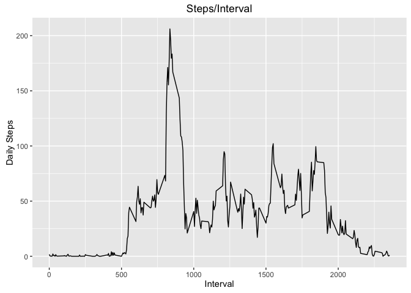
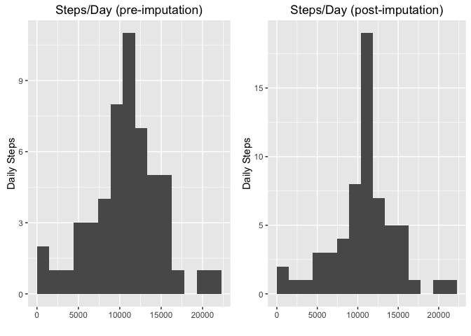
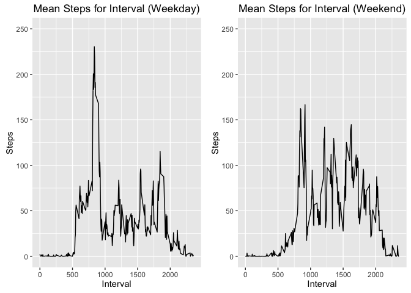

# Reproducible Research: Peer Assessment 1


##Load the data
This data was downloaded from the following location:  
**URL:** <https://d396qusza40orc.cloudfront.net/repdata%2Fdata%2Factivity.zip>  
**Downloaded:** August 21, 2016 9:00 PM

## Loading and preprocessing the data 

```r
setwd("~/Documents/GitHub/RepData_PeerAssessment1")
activities <- read.csv("activity.csv", colClasses=c("integer","Date","integer"))
summary(activities$steps)
```

```
##    Min. 1st Qu.  Median    Mean 3rd Qu.    Max.    NA's 
##       0       0       0      37      12     806    2304
```

## What is the average daily activity pattern?

```r
stepsByInterval<- as.data.frame(as.list(aggregate(steps~interval, data=activities, FUN = function(x) c(total = mean(x,na.rm=TRUE)))))

tsPlot<- ggplot(stepsByInterval, aes(interval, steps, group=1)) + geom_line()  + xlab("Interval") + ylab("Daily Steps") + ggtitle("Steps/Interval")
tsPlot
```

<!-- -->

### Interval containing maximum steps on average

```r
maxInterval <- stepsByInterval[which.max(stepsByInterval$steps),]
maxInterval
```

```
##     interval steps
## 104      835   206
```

We find that the interval with the highest average steps is **835** with an average of **206.17** steps.

## Imputing missing values

```r
naCount <- nrow(activities[is.na(activities$steps),])
naCount
```

```
## [1] 2304
```

We find a substantial amount of missing data in the dataset (**2304 NA** values for steps variable) 

Due to the nature of the data, where time plays a major role in step count, we decided against a simple mean replacement for missing values. Instead, we decided to replace missing values with the mean calculated for that specific interval.  


```r
# Impute missing data using the average corresponding to the associated interval

#Duplicate the dataset 
activitiesImp <- activities

#loop through the new dataset replacing missing data
for(i in 1:nrow(activitiesImp)){
        if(is.na(activitiesImp[i,1])){
                activitiesImp[i,1] <- stepsByInterval[stepsByInterval$interval==activitiesImp[i,3],"steps"]
        }
}
summary(activitiesImp$steps)
```

```
##    Min. 1st Qu.  Median    Mean 3rd Qu.    Max. 
##       0       0       0      37      27     806
```

## What is mean/median steps taken per day?

```r
stepsByDay<- as.data.frame(as.list(aggregate(steps~date, data=activities, FUN = sum,na.rm=TRUE)))
mean(stepsByDay$steps)    # Pre-imputation mean
```

```
## [1] 10766
```

```r
 median(stepsByDay$steps) # Pre-imputation median
```

```
## [1] 10765
```

```r
stepsByDayPost<- as.data.frame(as.list(aggregate(steps~date, data=activitiesImp, FUN = sum, na.rm=TRUE)))
mean(stepsByDayPost$steps)   # Post-imputation mean
```

```
## [1] 10766
```

```r
median(stepsByDayPost$steps) # Post-imputation median
```

```
## [1] 10766
```

## Histograms of Steps/Day

```r
histPre  <- ggplot(stepsByDay,     aes(steps)) + geom_histogram(bins=15)  + xlab("") + ylab("Daily Steps") + ggtitle("Steps/Day (pre-imputation)") + scale_x_continuous(limits=c(0,22250))
histPost <- ggplot(stepsByDayPost, aes(steps)) + geom_histogram(bins=15)  + xlab("") + ylab("Daily Steps") + ggtitle("Steps/Day (post-imputation)") + scale_x_continuous(limits=c(0,22250))

pushViewport(viewport(layout = grid.layout(1, 2)))
print(histPre, vp = viewport(layout.pos.row = 1, layout.pos.col = 1))
print(histPost, vp = viewport(layout.pos.row = 1, layout.pos.col = 2))
```

<!-- -->


## Comparison of Activities Weekdays vs. Weekends


```r
library(timeDate)
library(grid)

#aggregate the data by interval - 2 sets of results (weekdays and weekends)
stepsByIntervalWeekday <- as.data.frame(as.list(aggregate(steps~interval, data=activitiesImp[isWeekday(activities$date),], FUN = mean, na.rm=TRUE)))

stepsByIntervalWeekend <- as.data.frame(as.list(aggregate(steps~interval, data=activitiesImp[isWeekend(activities$date),], FUN=mean, na.rm=TRUE)))

#create the 2 plots (notice that we scale the y-axis similarly on both plots for easier comparison)
weekdayPlot <- ggplot(stepsByIntervalWeekday, aes(interval, steps, group=1)) + geom_line()  + xlab("Interval") + ylab("Steps") + ggtitle("Mean Steps for Interval (Weekday)")+ scale_y_continuous(limits=c(0,250))
weekendPlot <- ggplot(stepsByIntervalWeekend, aes(interval, steps, group=1)) + geom_line()  + xlab("Interval") + ylab("Steps") + ggtitle("Mean Steps for Interval (Weekend)") + scale_y_continuous(limits=c(0,250))

#show the plots
pushViewport(viewport(layout = grid.layout(1, 2)))
print(weekdayPlot, vp = viewport(layout.pos.row = 1, layout.pos.col = 1))
print(weekendPlot, vp = viewport(layout.pos.row = 1, layout.pos.col = 2))
```

<!-- -->

We see a distinct difference in activity between weekdays and weekends.  Weekend activity starts later, weekdays hitting 50 steps/interval just after 5:00, where similar activity levels are not seen until after 7:00 on weekends.  However, with the exception of a large spike in the 8:00 hour on weekdays, weekends are on average more active.
